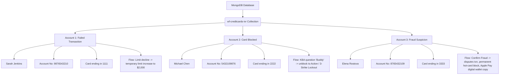

# AIVA Credit Card MCP Server & FastAPI Gateway

[](https://fastapi.tiangolo.com/)
[](https://www.mongodb.com/)
[](https://modelcontextprotocol.io/)
[](https://www.wellsfargo.com/)

A decoupled, stateful Model Context Protocol (MCP) server and HTTP REST Gateway styled exactly as a **Wells Fargo Credit Card IVR Integration**. It bridges the gap between raw backend core banking mainframes and conversational voice AI frameworks (such as Twilio Voice, Whisper, ElevenLabs, and CrewAI).

---

## 🧠 Core Philosophy: Dual-Channel Response Design

In conversational banking, there is a fundamental conflict between banking mainframes and customer experience:
1. **Core Banking Mainframes**: Require standardized financial transaction codes (**ISO 8583 Response Codes**) for auditing, fraud tracking, and transactional ledgers.
2. **Customers (Voice dialogue)**: Cannot understand technical codes (e.g., *"ISO 8583 Code 38"* or *"Decline Code 51"*). Speaking these will ruin the conversational flow.

AIVA resolves this by implementing a **Dual-Channel Response Architecture**:
* **🗣️ Customer Dialogue (`[AIVA IVR Dialogue]`)**: Friendly, empathetic, and 100% natural conversational language to be spoken directly to the user (via text-to-speech). All technical jargon is completely removed.
* **⚙️ System Audit Log (`[SYSTEM_LOG]`)**: Separated backend log structure appended at the bottom, housing the precise ISO 8583 response codes for downstream databases and engineering audits.

---

## 🔒 Implemented Core Banking & Security Safeguards

We have designed and verified five industry-grade banking workflow and security guards in the database core logic:

1. **Compromised Card Safety (ISO Code 43 - Stolen/Hot-Carded)**
   * **Rule**: Once a card is marked stolen/compromised via confirmed fraud (`confirm_fraud`), self-service unblocking is permanently disabled. Any unblock attempt (even with correct security answers) is rejected, and the customer is routed directly to a human representative.
2. **Duplicate Dispute Prevention (ISO Code 43 - Stolen/Hot-Carded)**
   * **Rule**: Blocks subsequent dispute submissions on the same transaction ID to prevent double-crediting inflation and audit duplicates.
3. **Override Blocks on Restricted Card (ISO Code 57 - Restricted Card)**
   * **Rule**: Rejects credit limit increase requests on cards that are Blocked, Locked Out, or Stolen.
4. **Fraud Clearing Validation (ISO Code 00 - Already Approved)**
   * **Rule**: Prevents clearing fraud alerts (`deny_fraud`) on normal successful transactions that were never flagged as suspicious by our fraud models.
5. **3-Strike KBA Verification Lockout (ISO Code 38 - PIN Try Limit Exceeded)**
   * **Rule**: To prevent brute-forcing cardholder verification, self-service unblocking locks out after exactly 3 failed attempts, requiring human agent verification.

---

## 📊 Isolated Demo Schema (3 Profiles)

To deliver a non-contaminating, scalable and bulletproof live demonstration, the database seeds **three distinct customer accounts** formatted identically to real **Wells Fargo Account Numbers (10 digits)**. Each profile isolates exactly one business flow:



---

## 🛠️ Setup & Configuration

### 1. Prerequisites
- **Python**: 3.10+
- **MongoDB**: A running MongoDB instance (Local or MongoDB Atlas)

### 2. Environment Configuration
Create a `.env` file in the root directory to manage your configurations:
```env
MONGO_URI=mongodb+srv://<username>:<password>@<cluster>.mongodb.net/?retryWrites=true&w=majority
MONGO_DB_NAME=Veda_Rituals
MONGO_COLLECTION_NAME=wf-creditcards-ivr
SERVER_HOST=0.0.0.0
SERVER_PORT=8000
```

### 3. Installation
Install core requirements using pip:
```bash
pip install -r requirements.txt
```

---

## 🚀 Execution & Verification

### 1. Seeding and Auto-testing
Run the programmatic automation suite to completely reset the database, execute all 18 standard and negative test cases, and dynamically compile the beautiful visual HTML documentation:
```bash
python run_automated_tests.py
```
This test runner executes:
* Sarah Jenkins limit increase happy path & restricted card limit override block.
* Michael Chen unblocking happy path & sequential 3-strike brute-force lockout.
* Elena Rostova fraud disputes, duplicate disputes block, and unblocking compromised card blocks.
* Elena Rostova fraud denial clearing & non-flagged fraud clearing block.

### 2. Start HTTP Gateway (Postman Testing)
Start the FastAPI REST gateway to test using Postman or manual HTTP POST payloads:
```bash
python server.py
```
* **Endpoint**: `POST http://localhost:8000/api/credit-card`
* **Swagger UI Docs**: `http://localhost:8000/docs`
* **HTML Report**: Open `integration_docs.html` in a web browser to review the visual conversation chat timeline, high-resolution visual sequence diagrams, and copy-paste actual live JSON requests/responses.

### 3. Start Stdio MCP Mode (CrewAI Integration)
To bind the Model Context Protocol directly to the CrewAI agent orchestrator via stdio:
```bash
python server.py --mcp
```

#### CrewAI MCP Configuration (`mcp_config.json`)
Configure your CrewAI orchestrator or desktop client using this block:
```json
{
  "mcpServers": {
    "aiva-creditcard-mcp": {
      "command": "python",
      "args": ["C:/Users/bhatn/OneDrive/Documents/Projects/AntiGravity/aiva-creditcard-mcp/server.py", "--mcp"]
    }
  }
}
```

---

## 📂 Project Architecture

* **`server.py`**: Houses the dual FastMCP stdio server and FastAPI REST gateway.
* **`run_automated_tests.py`**: Executes the 18 automated test suites, capturing live JSON traces to compile the master documentation.
* **`seed_db.py`**: Seeds MongoDB with Wells Fargo test profiles.
* **`integration_docs.html`**: Handover reference with pixel-clean fullscreen sequence diagram modals, conversational chats, and live REST JSON traces.
* **`.gitignore`**: Excludes credentials (`.env`) and python compilation directories from Git tracking.
